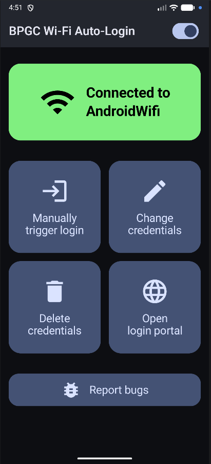

An app to automatically log into BITS campus networks

# Note:

- This app is android-only. For desktop devices, use [auto-campnet](https://github.com/Devsoc-BPGC/auto-campnet). For ios, ...idk
- The app requires location permissions because android doesn't allow it to read the current Wi-Fi SSID without those permissions.
- This app was initially made for the goa campus, but I am working on supporting all three campuses.

# Installation instructions
## Method 1: direct apk download
1) Go to [the latest release](https://github.com/Dhruv00000/bits-wifi-autologin/releases/latest).
2) Download the apk file.
3) Run the apk file to install the app.

# Showcase

# Credits:
1) My friends for helping me test this app
2) [Magnific](https://www.magnific.com/icons) for the [app icon](https://www.flaticon.com/free-icon/wifi_1589718)
3) The [original app](https://github.com/sparshg/wifi-login)'s author for inspiration
